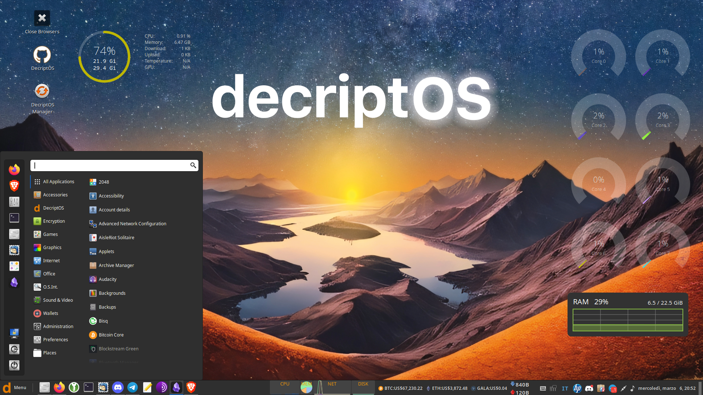

# DecriptOS Menu

DecriptOS is designed with the modern user in mind, bringing together a wide array of applications and tools that span across various categories for a comprehensive desktop experience. The DecriptOS menu is your gateway to exploring these tools, each carefully selected and integrated to enhance your interaction with the digital world, particularly the evolving web3 ecosystem. Here's an overview of what you can expect:

<figure><figcaption>
DecriptOS Menu
</figcaption></figure>

## Accessories

The [Accessories](learning-resources/menu/accessories.md) section houses everyday tools and utilities that aid in daily tasks, including calculators, text editors, and archive managers. Whether you need to take quick notes, manage compressed files, or perform simple calculations, this section has got you covered.

## DecriptOS

This category is the heart of [DecriptOS](learning-resources/menu/decriptos.md), featuring proprietary tools and utilities specifically designed to enhance your privacy, security, and ease of use within the web3 space. From managing your MAC address to utilizing the DecriptOS Manager for system updates and TOR integration, these tools underscore the operating system's commitment to user security and privacy.

## Encryption

In today's digital age, data security is paramount. The [Encryption](learning-resources/menu/encryption.md) section provides a suite of robust tools like VeraCrypt, KeepassXC, and Kleopatra, among others, to secure your sensitive data through strong encryption methods, ensuring your digital privacy and security.

## Graphics

For the creatively inclined, the [Graphics](learning-resources/menu/graphics.md) section offers a range of applications for image editing, vector design, and document scanning. With renowned tools like GIMP, Inkscape, and LibreOffice Draw, you can unleash your creativity and bring your visual projects to life.

## Internet

Stay connected with the world through a variety of [internet tools](learning-resources/menu/internet.md) available in DecriptOS. From web browsers like Firefox ESR and Brave to communication platforms like Telegram and Discord, this section ensures you're well-equipped for all your online activities.

## Office

The [Office](learning-resources/menu/office.md) category provides essential productivity tools for document viewing, creation, and management. LibreOffice stands out as a comprehensive office suite, alongside specialized applications like Zathura and Document Viewer for managing PDFs and other documents.

## OSINT

For users interested in the investigative and research side of the web, especially in the crypto space, the [OSINT](learning-resources/menu/osint.md) (Open Source Intelligence) tools like TheHarvester, Sherlock, and Nikto offer powerful capabilities for gathering and analyzing publicly available data.

## Sound & Video

Whether you're editing audio tracks with Audacity, streaming with OBS Studio, or simply enjoying media with VLC Media Player, the [Sound & Video](learning-resources/menu/sound-and-video.md) section is packed with multimedia applications to cater to both content creators and consumers.

## Crypto Wallets

In DecriptOS, we understand the pivotal role of secure and efficient digital asset management in today's [Web3](learning-resources/web3-tools/web3-tools-list.md) world. That's why we've integrated a variety of reputable and user-friendly cryptocurrency wallets directly into the system. Whether you're a seasoned trader or just starting out in the world of digital currencies, our selection of wallets ensures that your crypto assets are managed securely and conveniently.

***

The DecriptOS menu is thoughtfully curated to ensure that you have the necessary tools at your fingertips, catering to a wide array of tasks and workflows. This diverse collection of applications underscores DecriptOS's commitment to providing a rich, user-friendly desktop experience while emphasizing security, privacy, and the seamless integration of web3 technologies.

Explore, discover, and make the most out of these tools as you navigate through DecriptOS, your gateway to a secure and efficient digital experience.
